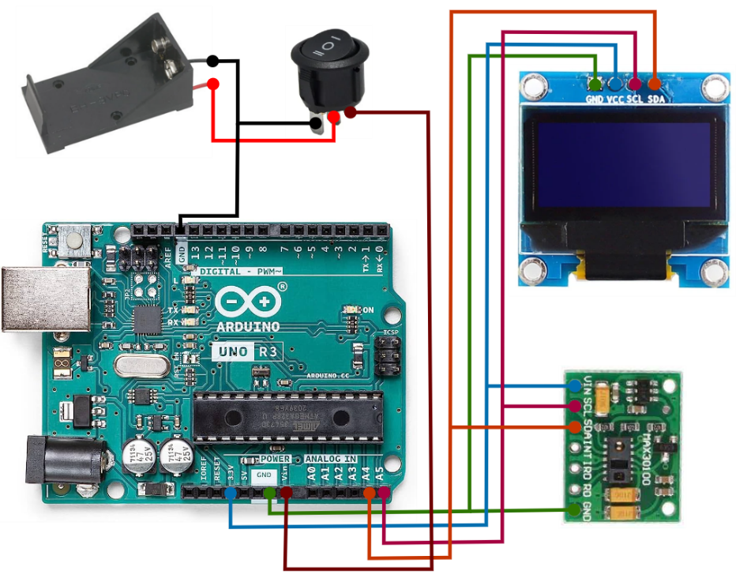

**Arduino-Based Non-Invasive Glucometer**

This project demonstrates the creation of an Arduino-based non-invasive glucometer. The glucose level is estimated using a trained polynomial regression model based on heart rate (BPM) and oxygen saturation (SpO2) values obtained from the MAX30100 sensor. Below is an explanation of the project, including the circuit diagram and implementation details.

**Project Description**

The non-invasive glucometer is designed to measure blood glucose levels using photoplethysmography (PPG) signals from the MAX30100 sensor, which provides both BPM and SpO2 readings. By applying a polynomial regression model trained on a predetermined dataset, the system can estimate glucose levels without the need for invasive blood sampling.

**Features**

1.  **Non-Invasive Measurement**: Utilizes PPG technology to estimate glucose levels without requiring blood samples.
2.  **Real-Time Monitoring**: Continuously monitors BPM and SpO2, providing real-time data.
3.  **Polynomial Regression Model**: Implements a trained polynomial regression model for glucose estimation. [“Reference”](https://emitter.pens.ac.id/index.php/emitter/article/view/766)
4.  **Display Output**: Uses an OLED display to show the estimated glucose level, BPM, and SpO2. Also, the last 3 measurements are displayed on the OLED screen for tracking purposes.

****

**Components**

1.  **Arduino Uno**: The microcontroller that processes sensor data and performs calculations.
2.  **MAX30100 Sensor**: Measures heart rate and oxygen saturation.
3.  **128×64 0.96**" **SSD1306 OLED Display**: Displays the output readings.
4.  **9V Power Supply**: Battery holder and switch for powering the device.

**Required Libraries For the Code**

1.  "Adafruit GFX" library by Adafruit.
2.  "Adafruit SSD1306" library by Adafruit.
3.  "MAX30100 PulseOximeter" library by OXullo Intersecans.

**Troubleshooting 😫**

Suppose everything is in its place and there is a problem with communication between the controller and the sensor module. In that case, your module's SCL and SDA pins are pulled up with 1.8 V. So, you have to solder the SCL and SDA pins pull-up resistors to the other regulator as shown in the [referenced video](https://youtu.be/kiN4Wu-CCTM?si=pLGY-WoQH3sKH0s0).

**References**

-   Shubha B, Anuradha M G, Poornima N, Suprada H S, & Prathiksha R V. (2023). An Implementation of blood Glucose and cholesterol monitoring device using non-invasive technique. *EMITTER International Journal of Engineering Technology*, *11*(1), 76-88. <https://doi.org/10.24003/emitter.v11i1.766>
-   <https://youtu.be/kiN4Wu-CCTM?si=pLGY-WoQH3sKH0s0>
